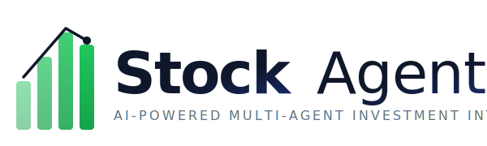

<div align="center">
  
</div>

<br/>

<div align="center">

*Pronounced: /stɒk-eɪ-dʒənt/*

**S**mart **T**rading **O**rchestration for **C**omprehensive Stoc**K** — **A**nalysis **G**enerating **E**xpert **N**eural **T**heses

</div>

<p align="center">
  <a href="https://github.com/Lavanyacheshani/StockAgent/actions/workflows/ci.yml">
    
  </a>
  <a href="https://github.com/Lavanyacheshani/StockAgent/blob/main/LICENSE">
    
  </a>
  
  
</p>

---

**StockAgent** is a production-grade, AI-powered investment analysis platform that identifies the top 5 U.S. stocks with the highest potential for market outperformance. It employs a hierarchical multi-agent architecture built on [CrewAI](https://www.crewai.com/) — integrating real-time financial data, sentiment analysis, and quantitative modeling to deliver transparent, actionable investment recommendations.

> **Disclaimer:** This software is for educational and informational purposes only. It does not constitute financial advice. Always consult a qualified financial advisor before making investment decisions.

---

## Table of Contents

- [Overview](#overview)
- [Features](#features)
- [Architecture](#architecture)
- [Prerequisites](#prerequisites)
- [Installation](#installation)
- [Configuration](#configuration)
- [Usage](#usage)
- [Output Format](#output-format)
- [Testing](#testing)
- [Deployment](#deployment)
- [Contributing](#contributing)
- [License](#license)

---

## Overview

StockAgent orchestrates **9 specialized AI agents** in a hierarchical pipeline:

1. **Data Collection** — Fetches financials, price history, and macroeconomic indicators from Alpha Vantage and Yahoo Finance.
2. **Sentiment Analysis** — Extracts and scores market sentiment from news and social media via Serper and VADER/TextBlob NLP.
3. **Fundamental & Technical Analysis** — Evaluates valuation ratios, growth metrics, moving averages, and momentum indicators.
4. **Synthesis & Ranking** — Aggregates multi-dimensional signals into a composite score, ranking stocks across the S&P 500.
5. **Thesis Generation** — Produces detailed, explainable investment theses for the top 5 selections.

All agent interactions are traced end-to-end via [LangSmith](https://smith.langchain.com/) for full observability and auditability.

---

## Features

| Category | Details |
|----------|---------|
| **Multi-Dimensional Analysis** | Fundamentals, technicals, sentiment, and macro indicators combined |
| **Sentiment Engine** | Real-time news + social media scoring (VADER & TextBlob) |
| **Resilient Execution** | Deterministic fallbacks and retry logic for API failures |
| **Full Observability** | LangSmith telemetry for every agent decision and tool call |
| **Configurable Pipeline** | Adjustable LLM models, timeouts, and parallelism per agent |
| **Multiple Interfaces** | CLI, Streamlit UI, FastAPI REST API, and React dashboard |
| **Production Docker** | Multi-stage build, non-root user, health checks |

---

## Architecture

```
┌─────────────────────────────────────────────────────────────┐
│                    Portfolio Manager (GPT-4o)                │
│                    ── Orchestrator Agent ──                  │
├────────────┬────────────┬────────────┬──────────────────────┤
│  Fact      │ Sentiment  │ Analysis   │  Optimization        │
│  Agent     │ Agent      │ Agent      │  Agent               │
├────────────┼────────────┼────────────┼──────────────────────┤
│ Alpha      │ Serper     │ Yahoo      │  Synthesizer         │
│ Vantage    │ Firecrawl  │ Finance    │  Agent               │
│ Tool       │ VADER/TB   │ Tool       │                      │
├────────────┴────────────┴────────────┼──────────────────────┤
│          Justification Agent         │  Thesis Agent        │
├──────────────────────────────────────┼──────────────────────┤
│              Recommendation Agent    │  → outputs/          │
└──────────────────────────────────────┴──────────────────────┘
```

---

## Prerequisites

- **Python 3.11** (required — see `pyproject.toml`)
- **[uv](https://docs.astral.sh/uv/)** (recommended) or pip
- **Docker** (optional, for containerized deployment)

### API Keys

| Service | Purpose | Get a Key |
|---------|---------|-----------|
| OpenAI | LLM agents (GPT-4o / GPT-4o-mini) | [platform.openai.com](https://platform.openai.com/) |
| Alpha Vantage | Financial time-series data | [alphavantage.co](https://www.alphavantage.co/support/#api-key) |
| Serper | Google News search for sentiment | [serper.dev](https://serper.dev/) |
| Firecrawl | Web scraping for sentiment | [firecrawl.dev](https://firecrawl.dev/) |
| LangSmith | Agent observability & tracing | [smith.langchain.com](https://smith.langchain.com/) |

---

## Installation

### Local Setup

```bash
git clone https://github.com/Lavanyacheshani/StockAgent.git
cd StockAgent

python -m venv .venv
# Linux / macOS
source .venv/bin/activate
# Windows
.venv\Scripts\activate

# Install with uv (recommended)
uv sync

# Or with pip
pip install -r requirements.txt
```

### Docker Setup

```bash
docker build -t stockagent .
docker run -p 8501:8501 --env-file .env stockagent
```

Or using Docker Compose:

```bash
cp .env.example .env   # Fill in your API keys
docker compose up -d
```

---

## Configuration

Copy the example environment file and add your API keys:

```bash
cp .env.example .env
```

Required variables (see `.env.example` for full reference):

```env
OPENAI_API_KEY=sk-...
LANGSMITH_API_KEY=lsv2_pt_...
LANGSMITH_PROJECT=stock-agent
LANGSMITH_ENDPOINT=https://api.smith.langchain.com
LANGCHAIN_TRACING_V2=true
ALPHA_VANTAGE_KEY=...
SERPER_API_KEY=...
FIRECRAWL_API_KEY=fc-...
```

> **Security:** Never commit `.env` to version control. The `.gitignore` already excludes it.

---

## Usage

### CLI

```bash
# Run the full analysis pipeline
python -m stocksage.main run

# Training mode
python -m stocksage.main train

# Test mode
python -m stocksage.main test

# Replay a previous run
python -m stocksage.main replay --run_id <run_id>
```

### Streamlit UI

```bash
streamlit run src/stocksage/user_interface.py
```

Access at `http://localhost:8501`.

### FastAPI Backend + React Frontend

```bash
# Start the API server
python server.py                  # http://localhost:8000
# API docs at http://localhost:8000/api/docs

# Start the frontend (in a separate terminal)
cd frontend
npm install
npm run dev                       # http://localhost:5173
```

### Python SDK

```python
from stocksage.crew import StockSage  # internal module name

inputs = {
    "market": "US",
    "stock_universe": "S&P 500",
    "current_year": "2026",
    "analysis_date": "2026-03-02",
}

agent = StockSage()
result = agent.crew().kickoff(inputs=inputs)
```

---

## Output Format

Results are saved to the `outputs/` directory:

| File | Description |
|------|-------------|
| `thesis_json.json` | Top 5 stock picks with scores |
| `investment_thesis.json` | Detailed theses per stock |
| `investment_report.md` | Human-readable analysis report |

Example (`thesis_json.json`):

```json
{
  "analysis_date": "2026-03-02",
  "investments": [
    {
      "ticker": "AAPL",
      "company_name": "Apple Inc.",
      "recommendation": "Buy",
      "target_price": "$245.30",
      "thesis": "Strong ecosystem moat and services revenue growth...",
      "sentiment_score": 0.78,
      "sentiment_label": "Bullish"
    }
  ]
}
```

---

## Testing

```bash
# Run all unit tests
uv run pytest tests/ -v

# Run with coverage
uv run pytest tests/ --cov=src/stocksage --cov-report=term-missing

# Skip integration tests (require live API keys)
uv run pytest tests/ -m "not integration"
```

CI runs automatically on push/PR via GitHub Actions (lint, test, Docker build).

---

## Deployment

### Docker (Recommended)

The included `Dockerfile` uses a multi-stage build with:
- Non-root user (`appuser`)
- Health check endpoint
- Layer-cached dependency installation

```bash
docker compose up -d
```

### Environment Variables for Production

| Variable | Description |
|----------|-------------|
| `ALLOWED_ORIGINS` | Comma-separated CORS origins for the API (default: `http://localhost:5173`) |
| `OPENAI_API_KEY` | Required for all LLM agents |
| `ALPHA_VANTAGE_KEY` | Required for financial data |
| `SERPER_API_KEY` | Required for news sentiment |
| `FIRECRAWL_API_KEY` | Required for web scraping |
| `LANGSMITH_API_KEY` | Required for agent tracing |

---

## Contributing

Contributions are welcome. Please read [CONTRIBUTING.md](CONTRIBUTING.md) for guidelines on:

- Reporting bugs and requesting features
- Setting up the development environment
- Code style (Ruff, 100-char line length)
- Testing requirements
- Pull request workflow

For security vulnerabilities, see [SECURITY.md](SECURITY.md).

---

## License

This project is licensed under the MIT License — see [LICENSE](LICENSE) for details.

---

<p align="center">
  Built with <a href="https://www.crewai.com/">CrewAI</a> · <a href="https://smith.langchain.com/">LangSmith</a> · <a href="https://streamlit.io/">Streamlit</a>
</p>
